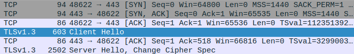

# Recherche de clef de chiffrement
_De Bats Joachim_

<br>

## Protocole avec Wireshark

Lors de la requete que fait curl, on observe 3 grandes étapes :
- un TCP Handshake
- un paquet __client hello__ contenant un nonce (Random), la cipher suite utilisée, l'id de la session,...
- un paquet __server hello__ contenant les même information pour le serveur.
  
<br>  

Dans wireshark, on peut utiliser le filtre `tls.handshake.extensions_server_name == "www.google.com"` si la commande exécuté est `curl https://www.google.com` pour ne voir que les paquets envoyés par nous vers www.google.com. On peut aussi filtrer pour voir tous les paquets ayant l'IP de www.google.com avec le filtre `ip.addr == IP` et ne garder que les paquets suivant le protocole TLS en ajoutant `tls`. (Pour combiner les filtres on utilise `&&`)

## Première tentative avec Ida64 free

<u>Principe :</u> Debugger l'executable ligne par ligne avec wireshark ouvert à coté pour trouver l'instruction qui envoit le paquet client hello.
<br>Debugger -> Process option -> Parameters pour donner des arguments lors de l'execution (www.google.com par exemple)

<u>Problème :</u> Les points de débuggage n'était enregistré que pour les bibliothèques chargés par curl, il fallait donc tout recommencer à chaque fois.

## Deuxième tentative avec le code source de curl


<u>Principe :</u> Ici encore l'objectif est de suivre les fonctions utilisés par curl jusqu'à trouver une fonction qui utilise le nonce.

git pour le code source de [curl](https://github.com/curl/curl)
<br>Pour compiler le code source de curl :
```bash
autoreconf -fi
./configure --with-openssl --prefix=/usr/local
make
sudo make install
```
On notera que l'on demande d'utiliser openssl mais il est possible d'utiliser d'autre bibliothèques pour l'encryption.

<u>Problème :</u> On se retrouve assez vite avec des boucles dans des boucles qui deviennent très pénible à suivre (easy_transfer dans easy.c et multi_perform dans multi.c)

## Troisième tentative avec Intel PinTool

Nouvelle approche, on regarde les bibliothèques chargé par curl pour ne regarder que les instructions de libcurl, puis on cherche par dichotomie sur le nombre d'instruction exécuté l'instruction qui envoit le paquet client hello en ayant Wireshark ouvert à coté.
Après une première tentative en comptant toutes les instructions, cette tentative n'a pas marché car le nombre d'instruction variait trop d'un essai à l'autre. En essayant de compter les instructions seulement la première fois qu'elles sont appelées en revanche, ces variations diminuent grandement d'un essai à l'autre ce qui m'a parmis de réduire la zone vers laquelle le paquet est envoyé : avant la 15350ème instrutions. A partir de là j'ai enregistré l'adresse des 100 instructions précédents la 15350ème. En allant voir dans ida à quelles fonctions appartenaient ces instructions. Certaines font appel à des fonctions de openssl.c (curl/lib/vtls/) et l'utilisation de client_random.

Code du pintool :
```cpp
#include "pin.H"
#include <iostream>
#include <fstream>
#include <stdlib.h>
using std::hex;
using std::endl;
using std::ofstream;
using std::string;

uint64_t start=0;
uint64_t end=0;
uint64_t delta=434600;
static UINT64 icount = 0;
std::vector<ADDRINT> T;

KNOB< string > KnobOutputFile(KNOB_MODE_WRITEONCE, "pintool", "o", "result.out", "specify file name");
 
ofstream TraceFile;
 
//Permet de garder les 100 dernières instructions
VOID last100(ADDRINT rip){
    if(T.size() >= 100){
        T.erase(T.begin());    
    }
    T.push_back(rip);
}

//Compte le nombre d'instruction
VOID docount(ADDRINT rip) { 
    if (icount == 15350) { //A varier lors de la dichotomie
        int nonce;
        scanf(" stop%d", &nonce); //Permet de stopper le programme pour voir si le paquet est envoyé avant ou après.
    }
    icount++; 
}
 

VOID Instruction(INS ins, VOID* v)
{
	if (start && INS_Address(ins)>=start && INS_Address(ins)<end) {
    docount(IARG_INST_PTR);
    last100(IARG_INST_PTR);
    TraceFile <<"instruction : "<< icount <<" : "<<hex<< INS_Address(ins) - start <<endl;
    } 
} 

//Recherche de la zone contenant les instructions de libcurl
VOID ImageLoad(IMG img, VOID* v) { 
	if (IMG_Name(img)=="/usr/local/lib/libcurl.so.4"){
		start = IMG_LowAddress(img);
		end = IMG_HighAddress(img);
		}
	 }

VOID Fini(INT32 code, VOID* v)
{
    if (TraceFile.is_open())
    {
    	TraceFile << "Count : " << icount << endl;
        TraceFile.close();
    }
}
 
/* ===================================================================== */
/* Print Help Message                                                    */
/* ===================================================================== */
 
INT32 Usage()
{
    PIN_ERROR("This tool prints a log of image load and unload events\n" + KNOB_BASE::StringKnobSummary() + "\n");
    return -1;
}
 
/* ===================================================================== */
/* Main                                                                  */
/* ===================================================================== */
 
int main(int argc, char* argv[])
{
    // Initialize symbol processing
    PIN_InitSymbols();
 
    // Initialize pin
    if (PIN_Init(argc, argv)) return Usage();
    TraceFile.open(KnobOutputFile.Value().c_str());

    IMG_AddInstrumentFunction(ImageLoad, 0);
    INS_AddInstrumentFunction(Instruction, 0);
    PIN_AddFiniFunction(Fini, 0);
 
    // Start the program, never returns
    PIN_StartProgram();
    return 0;
}
```
Utilisation du pintool :
- Ce code est à mettre dans MyPinTool.cpp (source/tools/MyPinTool)
- Puis on execute 
```
make all TARGET=intel64
pin -t obj-intel64/MyPinTool.so -- curl https://www.google.com >/dev/null
```
- Le résultat se trouve dans result.out


Par ailleurs en examinant ces fontions j'ai pu constater qu'il est possible de mettre dans un fichier log client_random et d'autres informations directement lors de l'exécution grâce au fichier keylog.c dans le mçeme doss.
IL faut alors compiler un peu différement :
```bash
autoreconf -fi
USE_CURL_SSLKEYLOGFILE=true ./configure --with-openssl --prefix=/usr/local
make
sudo make install
```
et lors de l'éxecution de curl, préciser ou mettre le fichier log : `SSLKEYLOGFILE=./curl_ssl_keylog.keylog curl https://www.google.com`

Cette fonctionalité fait appel à la fonction curl_tls_keylog_write_line dans keylog.c, on peut donc à l'aide d'un print dans cette fonction afficher l'emplacement en mémoire du nonce.
Un problème subsiste cependant, le paquet est déjà envoyé lorsque l'on récupère l'adresse du nonce.

